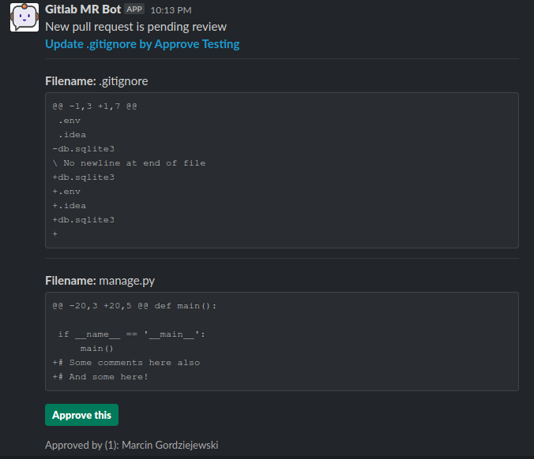
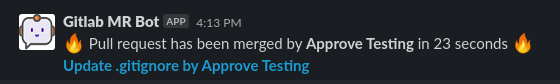
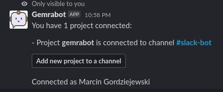

# Gemrabot
Short for Gitlab MErge Request Approval Bot - Gemrabot. This sound like Grammabot so treat it as so. 

Initial idea came from the problem that @ company I worked at sometimes we have burst of really 
small changes that due to internal policy have all to go through approval process. Because going through the 
Gitlab UI to see and approve these changes was (relatively) complicated, I came with the idea of having a bot 
that posts these small changes on slack and lets you directly approve them through slack - this way it embraces
ChatOps to really fasten the feedback loop. 

Messages reference are persisted on the bot side, that means whenever there is an update for the MR, 
it gets updated automatically in the same message. When new MR opens it shows full diff up to 20 lines,
if diff has more than 20 lines it shows only summary. When MR gets approved & merged - message is updated with short
information that MR has been merged - this way there is no mess on the channel because of that.

Approval currently works by providing Personal Access Token with `api` scope when configuring the bot.
Everyone who wants to have ability to approve under their name has to provide such token. 

Sadly Gitlab doesn't offer granular scoped tokens, so the only way to approve under your own name is to 
provide FULL access to the bot. This is a security concern but :shrug:

# Screenshots





# How to deploy and use
Currently, for development I use cloud version of https://github.com/beyondcode/expose. 
I'll publish the app for general use once it is fully completed.

To run the project for yourself, you've to set up three environmental variables:
```
GITLAB_API_KEY # Used for getting information about MRs 
SLACK_CLIENT_ID # Used to authorize slack application
SLACK_CLIENT_SECRET # Same, you get it from slack apps 
 ```
